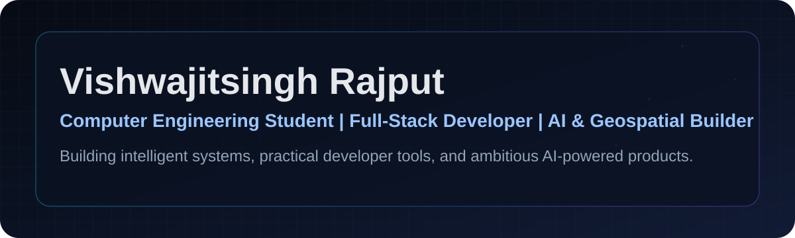
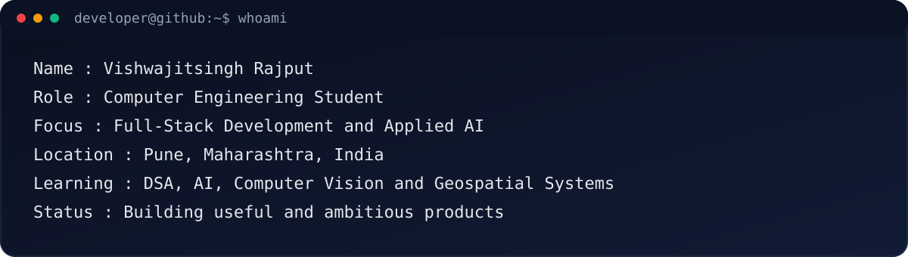
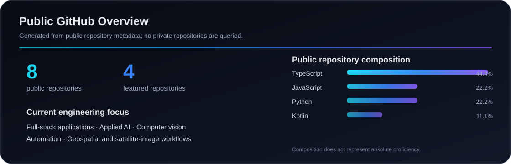
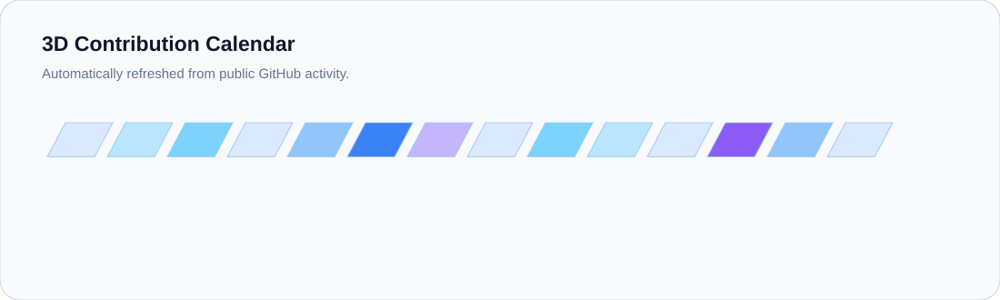

<!-- AUTO-GENERATED:START -->

Static fallback: Full-Stack Developer · AI & Geospatial Builder · Computer Engineering Student

<strong>Computer Engineering Student | Full-Stack Developer | AI & Geospatial Builder</strong>

Building intelligent systems, practical developer tools, and ambitious AI-powered products.

Pune, Maharashtra, India

[GitHub](https://github.com/Vishwajitsingh-rajput-27)

## About Me

I am a second-year Computer Engineering student at Indira College of Engineering and Management, affiliated with Savitribai Phule Pune University. My current focus includes full-stack development, applied artificial intelligence, computer vision, automation, and geospatial technology.

I enjoy converting complex ideas into structured and practical products with strong interfaces, reliable workflows, and clear documentation. Alongside project development, I am strengthening my problem-solving skills through Data Structures and Algorithms using Striver’s roadmap.

## What I’m Focused On

- Building practical full-stack applications
- Exploring applied AI and computer vision
- Developing research-oriented geospatial projects
- Improving Data Structures and Algorithms
- Participating in hackathons and open-source development

## Current Projects

### NoteNexus AI

**Status:** In Development

**Problem:** Academic materials are fragmented across notes, PDFs, assignments, videos, and messaging platforms.

**Proposed solution:** A unified study platform that organizes learning content and generates summaries, quizzes, flashcards, grounded question answering, and revision plans.

**Technology areas:** Full-stack web development · Applied AI · Document processing · Education technology

**Verified links:** [Repository](https://github.com/Vishwajitsingh-rajput-27/notenexus) · [Live demo](https://notenexus-azure.vercel.app)

---

### ResumeAI

**Status:** In Development

**Problem:** Students and early-career applicants often struggle to evaluate resume quality, identify missing skills, and prepare targeted applications.

**Proposed solution:** An AI-assisted career platform for resume analysis, ATS-aware improvement, skill-gap guidance, and interview preparation.

**Technology areas:** Next.js · Node.js · MongoDB · Applied generative AI

**Verified links:** [Related public implementation](https://github.com/Vishwajitsingh-rajput-27/Resume_Forge) · [Live demo](https://resume-forge-six-gamma.vercel.app/)

---

### Generative AI Cloud Removal

**Status:** Research Project / In Development

**Problem:** Clouds and shadows obscure useful information in optical satellite imagery and limit downstream analysis.

**Proposed solution:** A multimodal reconstruction workflow combining optical imagery, SAR data, elevation data, and temporal references while clearly separating prototypes from validated research results.

**Technology areas:** Python · Computer vision · Multimodal AI · Geospatial processing

**Verified links:** [Repository](https://github.com/Vishwajitsingh-rajput-27/clearSKY_AI)

## Technologies I Use and Explore

`C++` · `Python` · `JavaScript` · `TypeScript` · `React` · `Next.js` · `Node.js` · `Express.js` · `MongoDB` · `Tailwind CSS` · `Git` · `GitHub` · `OpenCV` · `Generative AI` · `Google Earth Engine`

> These are active project and learning areas. This profile does not claim advanced expertise in every listed technology.

<strong>Additional technologies used or explored</strong>

**Languages:** C · HTML · CSS

**Frontend:** shadcn/ui · Framer Motion · Zustand · React Hook Form · Zod · TanStack Query · Axios · Recharts

**Backend:** REST APIs · Socket.IO

**Databases and Authentication:** MongoDB Atlas · Firebase Authentication

**AI and Computer Vision:** OpenAI APIs · Google Gemini · Groq · Ollama · Computer Vision · Multimodal AI · Prompt Engineering

**Geospatial:** Sentinel-1 · Sentinel-2 · Digital Elevation Models · Satellite imagery processing · Remote-sensing workflows

**Development Tools:** GitHub Actions · Visual Studio Code · Termux · Ubuntu · Playwright · npm · Postman

**Deployment and Platforms:** Vercel · Render · Google Colab · Kaggle

## Featured Repositories

### [notenexus](https://github.com/Vishwajitsingh-rajput-27/notenexus)

An AI-powered study and knowledge platform that organizes academic content and generates practical learning resources.

- **Languages:** TypeScript · JavaScript
- **Last updated:** 2026-07-20
- **Links:** [Repository](https://github.com/Vishwajitsingh-rajput-27/notenexus) · [Live demo](https://notenexus-azure.vercel.app)

---

### [clearSKY_AI](https://github.com/Vishwajitsingh-rajput-27/clearSKY_AI)

A research-oriented platform for generative AI cloud removal and reconstruction workflows for satellite imagery.

- **Languages:** Python · TypeScript
- **Links:** [Repository](https://github.com/Vishwajitsingh-rajput-27/clearSKY_AI)

---

### [route-resilience-ai](https://github.com/Vishwajitsingh-rajput-27/route-resilience-ai)

Occlusion-aware road graph intelligence for urban disaster mobility.

- **Languages:** Python · TypeScript
- **Last updated:** 2026-06-27
- **Links:** [Repository](https://github.com/Vishwajitsingh-rajput-27/route-resilience-ai)

---

### [Resume_Forge](https://github.com/Vishwajitsingh-rajput-27/Resume_Forge)

A full-stack career toolkit for ATS-friendly resumes, application tailoring, interview preparation, and portfolio publishing.

- **Languages:** TypeScript · JavaScript
- **Last updated:** 2026-07-19
- **Links:** [Repository](https://github.com/Vishwajitsingh-rajput-27/Resume_Forge) · [Live demo](https://resume-forge-six-gamma.vercel.app/)

## Learning Focus

- Data Structures and Algorithms using Striver’s roadmap
- Advanced React and Next.js
- Backend engineering
- Artificial intelligence and machine learning
- Computer vision
- Generative AI
- Geospatial and satellite-image processing
- GitHub Actions
- Open-source development

## GitHub Overview

The overview above is generated inside this repository from verified public metadata, so this section remains useful without third-party statistics services.

### Public Repository Language Summary

| Language | Public repository composition | Method |
|---|---:|---|
| TypeScript | 44.44% | Repository occurrence fallback |
| JavaScript | 22.22% | Repository occurrence fallback |
| Python | 22.22% | Repository occurrence fallback |
| Kotlin | 11.11% | Repository occurrence fallback |

> Language statistics reflect the composition of public repositories and do not represent absolute proficiency.

## Contribution Activity

A visual representation of my GitHub contribution activity, generated automatically through GitHub Actions.

<picture>
  <source media="(prefers-color-scheme: dark)" srcset="https://raw.githubusercontent.com/Vishwajitsingh-rajput-27/Vishwajitsingh-rajput-27/output/github-contribution-grid-snake-dark.svg" />
  <source media="(prefers-color-scheme: light)" srcset="https://raw.githubusercontent.com/Vishwajitsingh-rajput-27/Vishwajitsingh-rajput-27/output/github-contribution-grid-snake.svg" />
  
</picture>

## 3D Contribution Calendar

<picture>
  <source media="(prefers-color-scheme: dark)" srcset="./assets/generated/contribution-3d-dark.svg" />
  <source media="(prefers-color-scheme: light)" srcset="./assets/generated/contribution-3d-light.svg" />
  
</picture>

## Collaboration

I am open to collaboration on open-source projects, hackathons, full-stack applications, AI-powered tools, education technology, computer vision, geospatial AI, and research-oriented student projects.

**Ask me about:** Full-stack web development · Applied AI product ideas · Computer vision prototypes · Geospatial workflows · Student hackathon projects · GitHub Actions automation

**Development goal:** Build reliable, useful products while developing strong engineering fundamentals, clear documentation habits, and open-source collaboration skills.

<!-- MANUAL-CONTENT:START -->
<!-- Manually protected content: add custom content here. The generator preserves this block exactly. -->
<!-- MANUAL-CONTENT:END -->

Profile data last refreshed: 2026-07-21

<!-- AUTO-GENERATED:END -->
